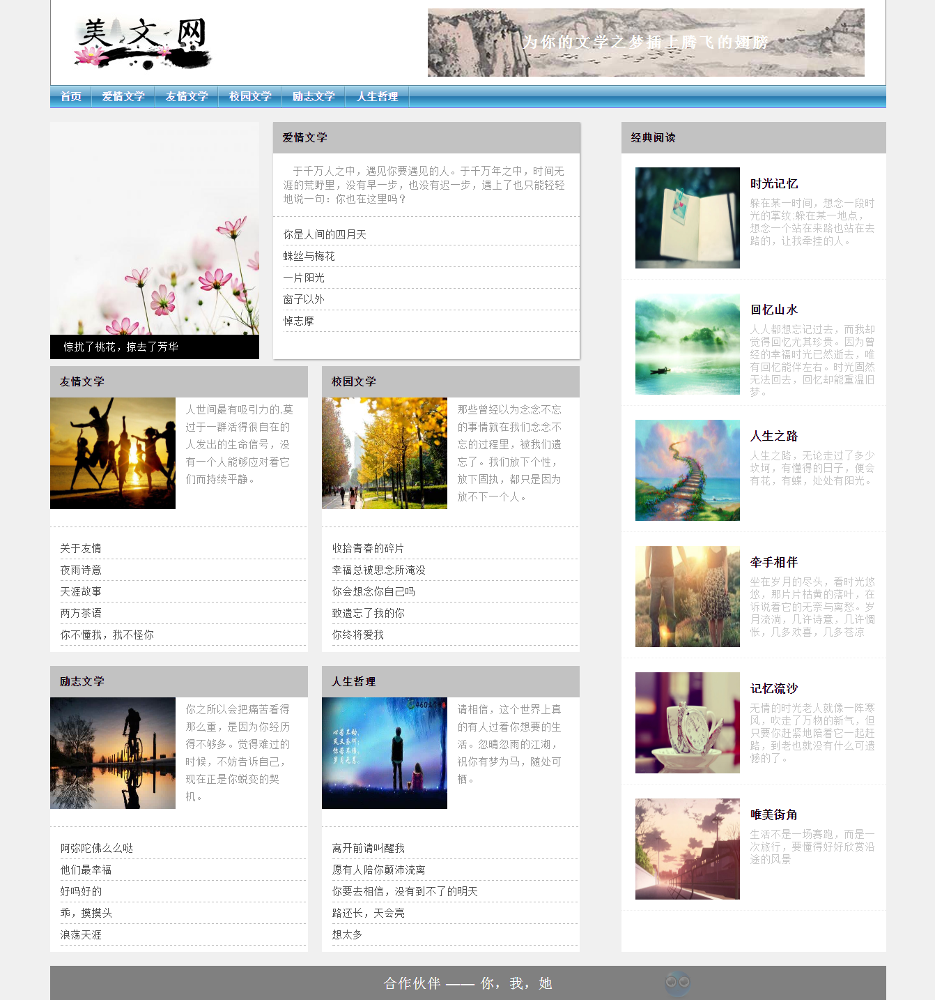
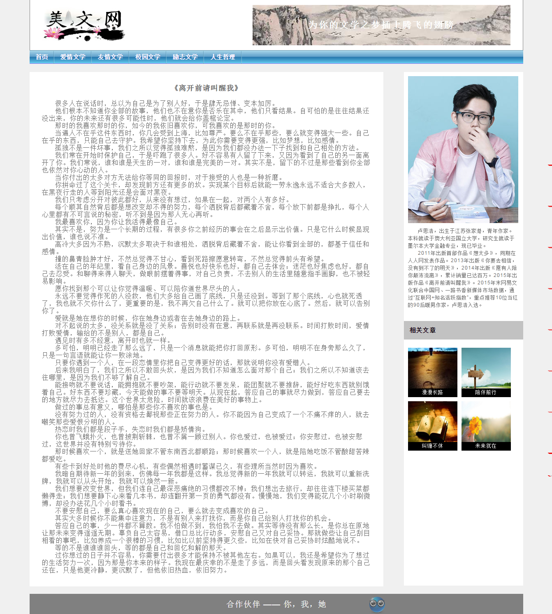

# 项目展示

纯CSS+HTML实现的一个文学欣赏展示页面。
* [点击查看项目展示](http://SuDaoJun.github.io/article/)

# 说明

##  主要功能点

#### 1. header头部右边文字实现动画

鼠标移到header头部右边的图片，文字的字间距过渡的缩小，鼠标移开图片，字间距恢复。

#### 2. nav导航栏实现切换到各个美文网页

鼠标移到每个导航实现变化颜色，分别点击每个导航到各自对应的美文网页

#### 3. content中间部分的图片实现缩放

鼠标移到content中间的图片，图片会进行放大或缩小，鼠标移开则恢复

#### 4.footer尾部表情图片实现循环动画
给footer表情图片加上animate动画，左右来回渐显渐隐运动

#### 5. 每个子页面content中间右边部分图片实现文字显显隐

鼠标移到图片，下面文字显示书名，鼠标移开，书名隐藏，点击图片分别跳转到对应的文章

## 交互及视觉说明

## 首页视觉图

## 子页爱情文学视觉图

## 子页友情文学视觉图

## 子页校园文学视觉图

## 子页励志文学视觉图

## 子页人生哲理视觉图

